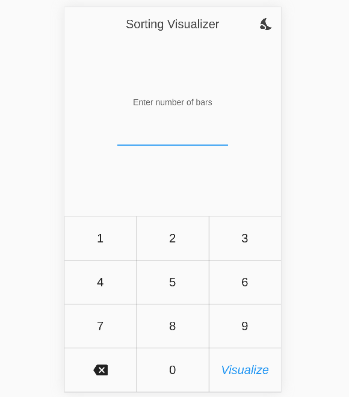

# Sorting Visualizer 

A *sorting visualizer* app in flutter. It visualize the sorting algorithm by sorting the bars
in ascending order. In this application how the elements change their position is being displayed.

## Sorting Algorithms

- Bubble Sort
- Insertion Sort
- Selection Sort
- Merge Sort
- Quick Sort

## Features

- Visualize 2 to 1000 elements
- Change the speed of the sorting
- Interacting elements are displayed in different colors
- Change theme to *light* or *dark*
- Selected theme is remembered between start ups

## Demo

> Light Theme

    
    

> Dark Theme

    
    

## Libraries Used
- [provider](https://pub.dev/packages/provider)
- [flutter_bloc](https://pub.dev/packages/flutter_bloc)
- [hydrated_bloc](https://pub.dev/packages/hydrated_bloc)

 
